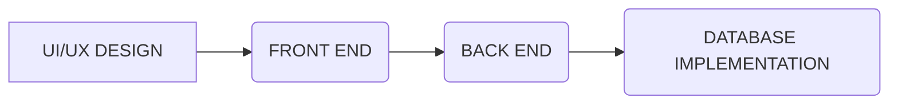

 

# **eLibrary - A digital space among readers**
Currently Available on [https://elib.rf.gd](https://elib.rf.gd)

## **Table of Content**
- [Overview](#Overview)
- What is the Purpose ?
- Development Process
- Dataflow Diagram
- ER Diagram
- Control Center ( Administration)
- Getting Started as a user
- Future Scopes

## Overview
E-Library is a web application which is a digital version of conventional libraries. Unlike conventional libraries, which are bound by physical constraints and operating hours, the E-Library offers unparalleled convenience and flexibility. Users can seamlessly navigate through a vast collection of e-books, articles, research papers, from any location with internet connectivity, at any time of the day. 

## What is the purpose ?
The purpose of the E-Library website is to serve as a digital hub for readers and learners, offering a wide range of e-books, articles, and resources. It’s designed to be a convenient and accessible platform for exploring diverse genres, engaging in discussions, and joining a community passionate about reading and learning.

The site aims to blend literature and information in the digital era, providing a gateway to expand horizons with every click. It’s a collaborative creation by students from the ITM department at Ravenshaw University, fostering a love for reading and learning.

## Development Process

Our Develop Process involved four stages: UI/UX design, front-end development, back-end development, and database implementation. It all started with creating the overall structural design of the website ensuring an attractive user interface and smooth navigation. 
Next, Front-end Developers bring that design to life. Back-end Developers handle the website's functionalities. Finally, the database is implemented to interact with realtime users via web services.

### Technologies Used: 

 
 
 
 

