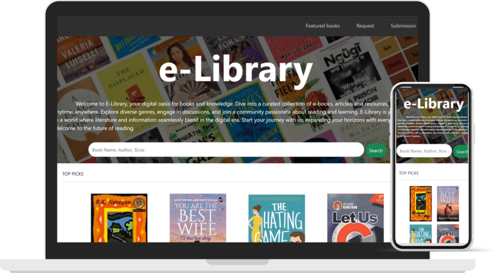
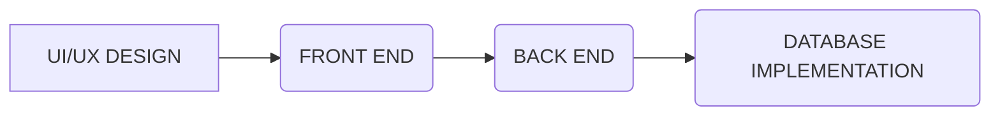
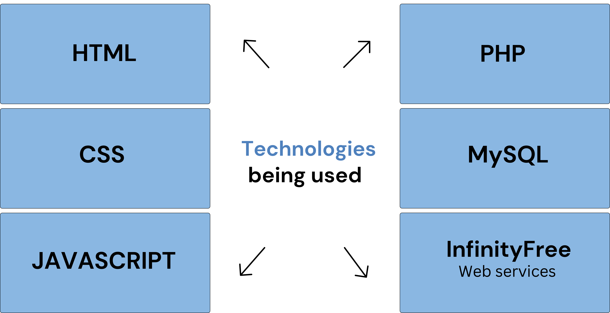
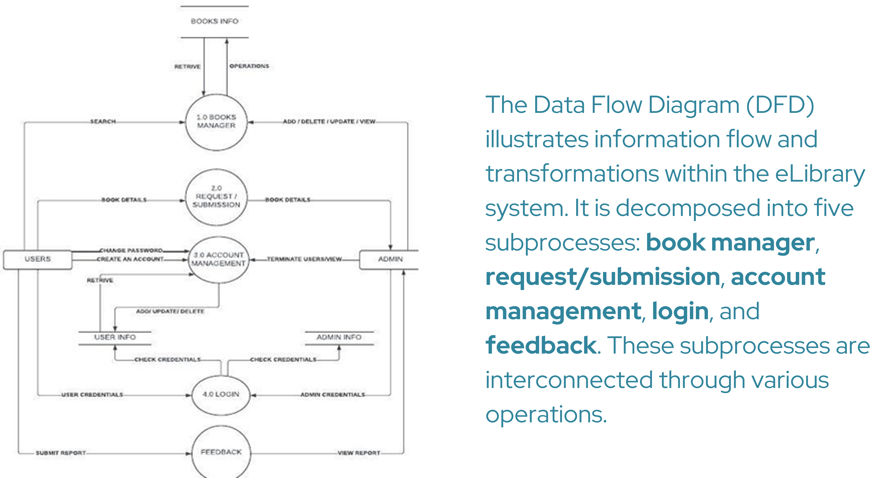
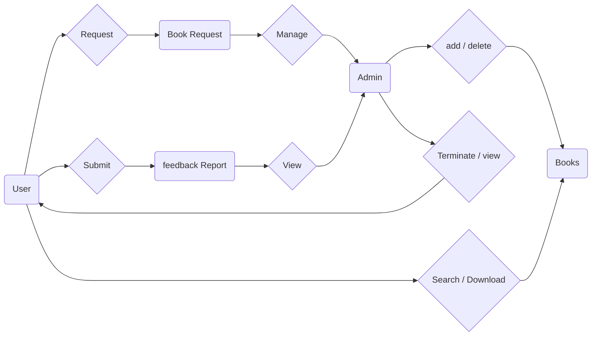
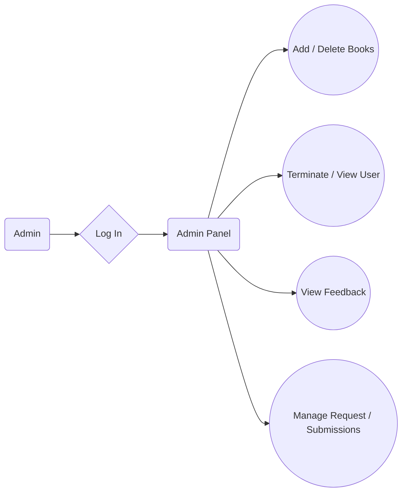

 

# **eLibrary - A digital space among readers** 
Currently Available on [**https://elib.rf.gd**](https://elib.rf.gd)

## **Table of Content**
- [Overview](#Overview)
- What is the Purpose ?
- Development Process
- Dataflow Diagram
- ER Diagram
- Control Center ( Administration)
- Getting Started as a user
- Future Scopes

## Overview
E-Library is a web application which is a digital version of conventional libraries. Unlike conventional libraries, which are bound by physical constraints and operating hours, the E-Library offers unparalleled convenience and flexibility. Users can seamlessly navigate through a vast collection of e-books, articles, research papers, from any location with internet connectivity, at any time of the day. 

## What is the purpose ?
The purpose of the E-Library website is to serve as a digital hub for readers and learners, offering a wide range of e-books, articles, and resources. It’s designed to be a convenient and accessible platform for exploring diverse genres, engaging in discussions, and joining a community passionate about reading and learning.

The site aims to blend literature and information in the digital era, providing a gateway to expand horizons with every click. It’s a collaborative creation by students from the ITM department at Ravenshaw University, fostering a love for reading and learning.

## Development Process

Our Develop Process involved four stages: UI/UX design, front-end development, back-end development, and database implementation. It all started with creating the overall structural design of the website ensuring an attractive user interface and smooth navigation. 
Next, Front-end Developers bring that design to life. Back-end Developers handle the website's functionalities. Finally, the database is implemented to interact with realtime users via web services.

 

## Data Flow Diagram (DFD)

## ER Diagram

The ER diagram for the eLibrary illustrates the relationships between essential tables, including admin, user, books, bookrequest, and feedback report. These tables are interconnected through specific types of relationships.

## Control Center (Administrative Panel)

- **Book Management:** Administrators can add books to the library based on user requests or to expand the collection.
- **Request Review:** They are responsible for reviewing and managing request / submissions from readers.
- **Information Accuracy:** Ensuring that the information provided for book additions is accurate to prevent future inconvenience.
- **User Feedback:** Considering feedback from users to improve the library’s services, such as expanding the book collection and enhancing visual appeal.

 

## Getting Started as User

